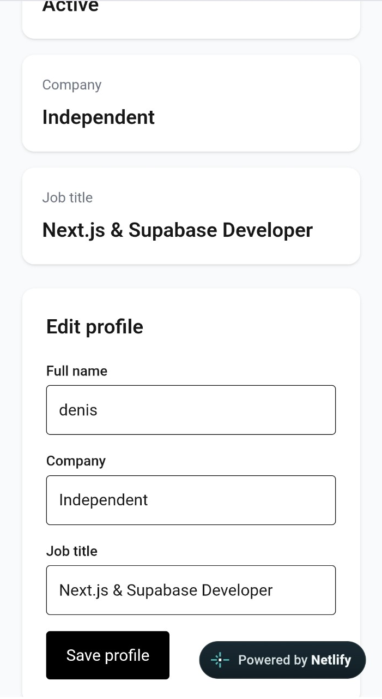
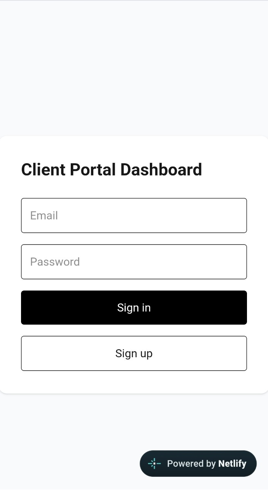
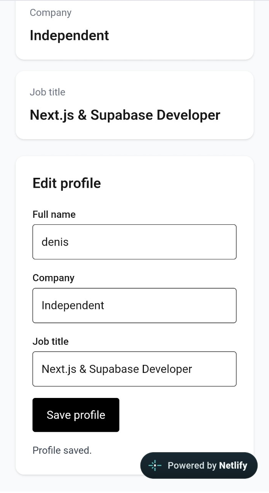

# Client Portal Dashboard

A small B2B client portal built with Next.js, TypeScript, Supabase and PostgreSQL.

## Live Demo

https://client-portal-dashboard-one.vercel.app

## What it does

Authenticated users can:

- sign in with email and password
- manage their profile
- create service requests
- view only their own requests
- track request status and priority

Supabase Row Level Security is used to keep data isolated between users.

## Screenshots

### Dashboard



### Login



### Profile Management



## Features

- Supabase email/password authentication
- Persistent sessions
- Protected dashboard routes
- Profile management
- Service request creation and history
- Request priority and status
- PostgreSQL persistence
- Row Level Security
- Loading, error and empty states
- GitHub Actions CI
- Vercel deployment

## Tech Stack

- Next.js
- React
- TypeScript
- Supabase
- PostgreSQL
- Tailwind CSS
- GitHub Actions
- Vercel

## Database Security

The project currently has separate RLS policies for:

- user profiles
- service requests

Authenticated users can only read and modify rows that belong to their own account.

Database behavior is tested with pgTAP against a local Supabase instance in CI.

Examples covered by the tests:

- User A can read their own profile
- User A cannot update User B's profile
- User A can create their own service request
- User A cannot update or delete User B's request

## Design Decisions

- PostgreSQL RLS is the final authorization boundary rather than relying only on client-side filtering.
- Database tests run against local Supabase in CI, so production credentials are not required.
- Browser and server Supabase clients are kept separate for Next.js session handling.
- Service requests use `user_id` ownership so authorization stays enforced at the database layer.

## Application Flow

```text
User
  ↓
Supabase Auth
  ↓
Protected Next.js Dashboard
  ├── Profile
  └── Service Requests
        ↓
Supabase PostgreSQL
        ↓
Row Level Security
