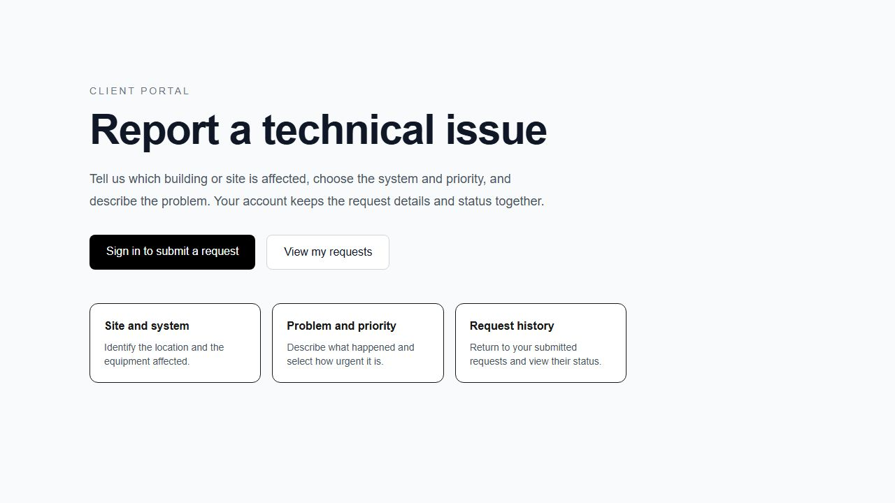
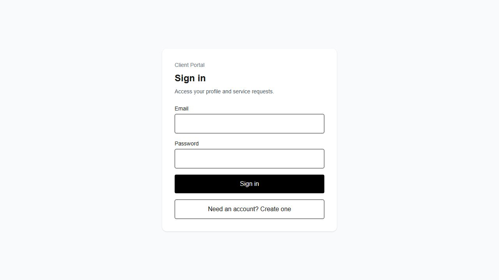
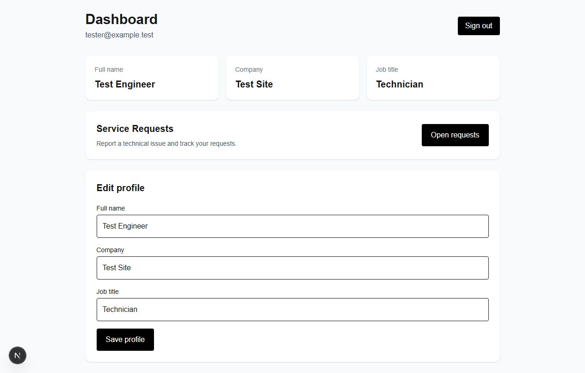

# Client Portal Dashboard

A service-request portal for building and site systems. Users sign in, update their profile and submit a request with a site, system, description and priority.

[Live demo](https://client-portal-dashboard-one.vercel.app)

## Scope

The portal currently provides account registration, a profile and a user's request history. Request statuses are stored in the database and displayed in the dashboard. There is no staff interface for assigning or closing requests yet.

Registration follows the Supabase project's email-confirmation setting: a returned session opens the dashboard; otherwise the user is asked to confirm their email before signing in. A failed request-list load offers a retry instead of showing an empty history.

## Implementation choices

- **Authorization lives in PostgreSQL.** Both profiles and requests have ownership policies. The request query does not add a browser-side user filter; RLS restricts the rows returned. The SQL tests verify that a second user cannot read or modify the first user's data.
- **Sessions cross the browser/server boundary.** Separate Supabase clients handle browser actions and server-side route protection. The browser uses only the publishable key.
- **Database checks are reproducible.** CI starts a local Supabase instance, replays the migrations and runs pgTAP. Production credentials are not needed.
- **The interface distinguishes failed loading from no data.** Creating a request has its own feedback, so a list-fetch error is shown beside the history rather than in the submission form.

## Screenshots

The home and sign-in views reflect the current interface. The profile view uses
isolated local test data.





## Run locally

Requirements: Node.js, npm and a Supabase project with the migrations in `supabase/migrations` applied. For database tests, also install the Supabase CLI and Docker.

```bash
git clone https://github.com/bondarenkodenis0907-web/client-portal-dashboard.git
cd client-portal-dashboard
npm ci
```

Create `.env.local`:

```env
NEXT_PUBLIC_SUPABASE_URL=your_supabase_project_url
NEXT_PUBLIC_SUPABASE_PUBLISHABLE_KEY=your_supabase_publishable_key
```

```bash
npm run dev
```

Open http://localhost:3000. Use your project's publishable key; never put a secret or service-role key in a `NEXT_PUBLIC_` variable.

## Checks

PRs and pushes to `main` run lint, Next.js route-type generation, TypeScript, a production build and the SQL tests. The CI build uses placeholder public Supabase values; it verifies compilation rather than a connection to the live backend.

```bash
npm run lint
npx next typegen
npx tsc --noEmit
npm run build
supabase start
supabase test db
```

See [the workflow](.github/workflows/ci.yml), [RLS tests](supabase/tests) and [dependency notes](docs/DEPENDENCY_SECURITY.md).

## Next work

- Add the staff workflow for request assignment and status changes.
- Cover the full browser flow with an isolated test backend.
- Add pagination once request history grows beyond a small list.
