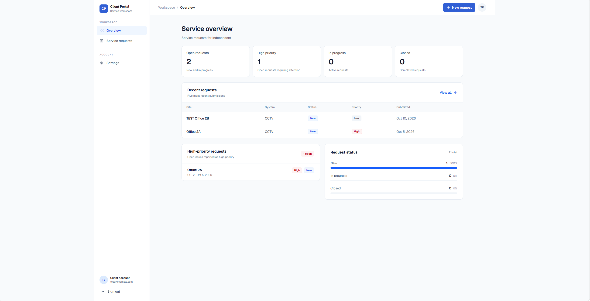
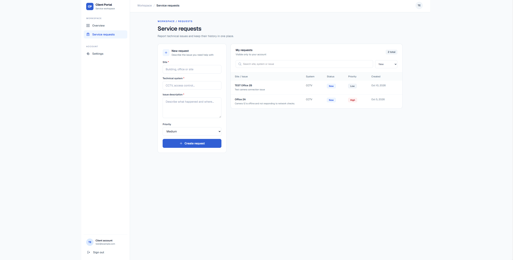
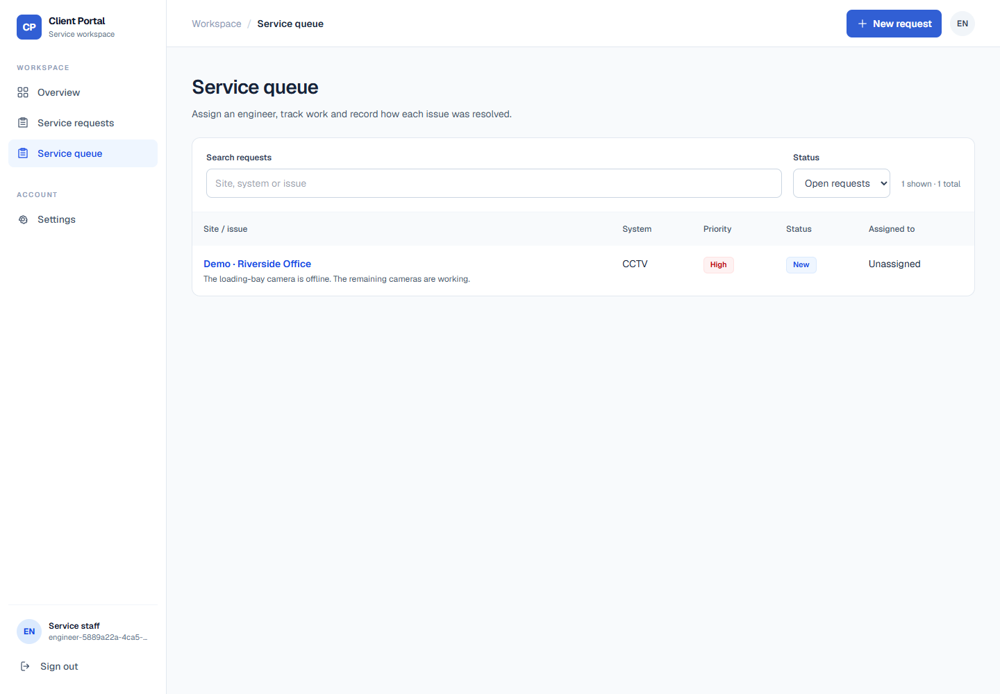
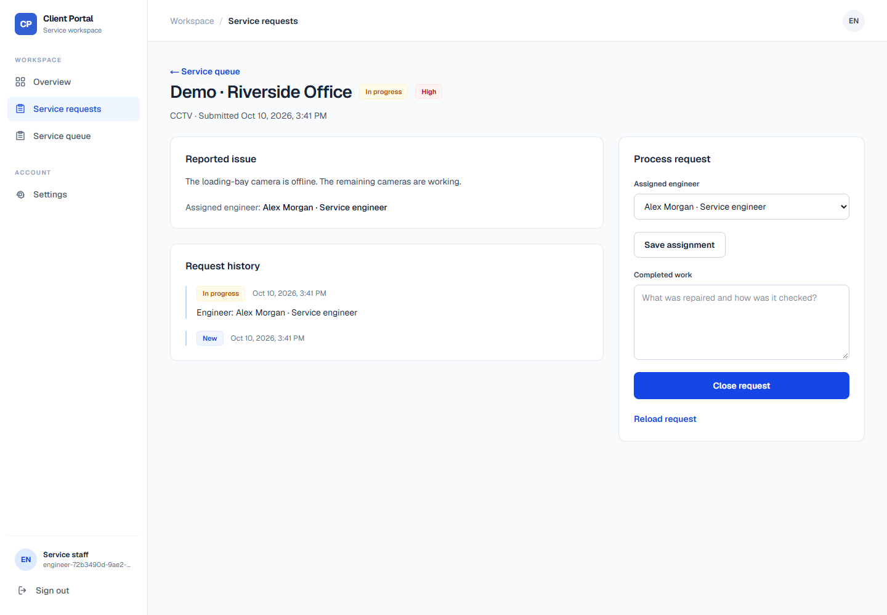
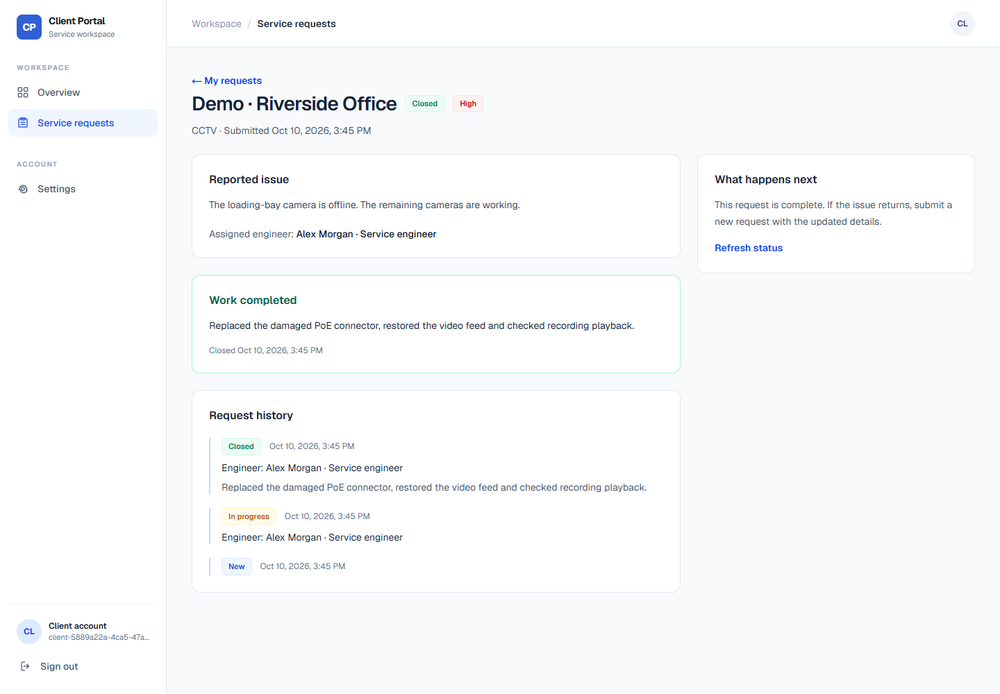
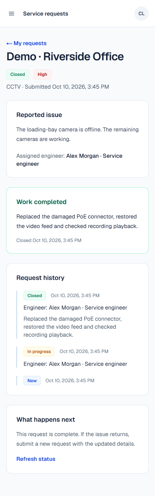
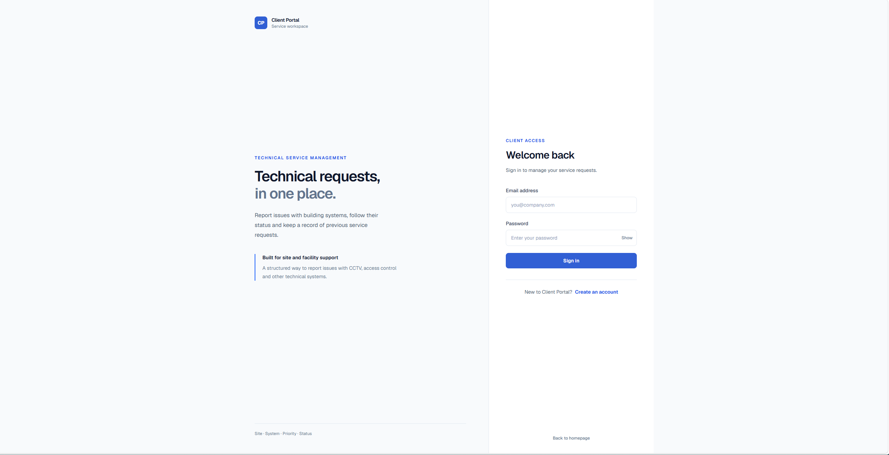
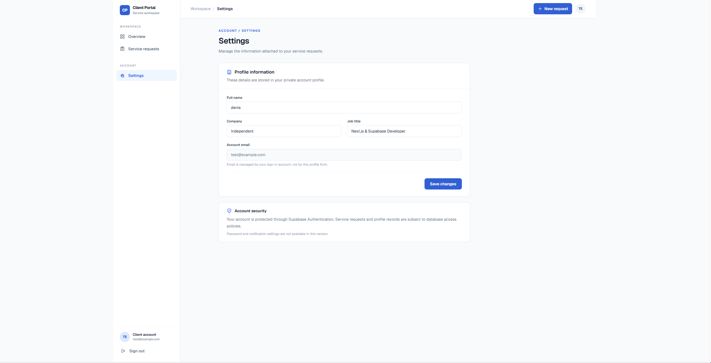

# Client Portal Dashboard

A service-request portal for building systems: clients report an issue, the service team assigns an engineer, and the client follows the work through to a recorded resolution.

[Live application](https://client-portal-dashboard-one.vercel.app) · [Checks](https://github.com/bondarenkodenis0907-web/client-portal-dashboard/actions) · [Discuss a similar project](https://t.me/BDenisD)

## The use case

A site coordinator needs to report a failed camera or access-control reader and find out what happened next. The service team needs a shared queue with priorities, an assigned engineer and a record of the completed work.

I built this portfolio project around that hand-off. It draws on my background in technical systems and troubleshooting; it is not presented as a paid client deployment or evidence of measured business results.

## From a reported issue to completed work

1. **The client submits a request.** The form records a site, system, issue description and priority. The dashboard shows their own requests, with search and status filters.
2. **The service team starts work.** Staff open the shared queue, choose an engineer and move the request from New to In progress. Open work can be reassigned.
3. **The engineer's work is recorded.** Closing requires a description of what was done. PostgreSQL records the closure time and a history entry in the same transaction.
4. **The client sees the result.** The request detail shows the assigned engineer, changes in status and the resolution. Closed requests remain read-only.

For example, the local demonstration follows an offline loading-bay camera: a coordinator reports it, an engineer starts work, then records replacement of a damaged PoE connector and a playback check. This is synthetic demonstration data, not a claim about an actual service visit.

## Screenshots

The first four captures were supplied from the updated client interface and show test data. The workflow captures come from the browser test against an isolated local backend; names, accounts and the service scenario are fictional.

### Client overview and request submission




### Assignment and work in progress




### Completed work visible to the client





### Sign-in and account settings




## Decisions and checks

**Client ownership and staff access are different permissions.** PostgreSQL RLS limits a client to their own requests and events. Staff membership is stored in an administrator-managed table, not in editable profile fields or user metadata. Staff can see the service queue, but their updates are limited to assignment, status and resolution. The personal overview still filters to the signed-in user's submissions.

**The database validates the lifecycle.** An engineer is required before work starts. A request cannot skip directly from New to Closed, and closure needs a resolution. A trigger writes change history; neither clients nor staff can edit or invent history entries through the Data API.

**Input limits are enforced in PostgreSQL.** Required request fields reject whitespace-only values, including Unicode whitespace. Site and system are limited to 120 characters, issue descriptions to 5,000, optional profile fields to 120 and completed work to 10–5,000. The resolution minimum excludes surrounding whitespace; the maximum applies to stored text. Form controls and submit handlers provide early feedback; the database also rejects invalid direct API writes.

**Query types come from the database schema.** Supabase clients use the generated `Database` type and UI models derive from table rows. Status and priority are text columns with SQL CHECK constraints, so query results are checked before they become finite UI states. Regenerate [the types](src/lib/supabase/database.types.ts) when changing the schema.

**A stale screen must not overwrite another update.** Saves include the request's last observed update time. If another staff member has changed it, the interface asks for a reload. Failed saves preserve form edits and do not show a successful closure.

**Checks use a real isolated backend.** SQL tests cover client isolation, staff membership, transitions and immutable history. The browser test signs in as a client and as staff, submits a request, assigns and closes it, and checks the result in the client's screen and the database. It also exercises a failed save, a stale update and a mobile viewport.

The application uses Next.js, React, TypeScript and Tailwind CSS. Supabase provides authentication and PostgreSQL. Browser code uses a publishable key; staff operations do not depend on a service-role key in the application.

## Run locally

Requirements: Node.js 22 or later, npm, the Supabase CLI and Docker.

```bash
git clone https://github.com/bondarenkodenis0907-web/client-portal-dashboard.git
cd client-portal-dashboard
npm ci
supabase start
```

Use the local values from `supabase status` in `.env.local`:

```env
NEXT_PUBLIC_SUPABASE_URL=http://127.0.0.1:55321
NEXT_PUBLIC_SUPABASE_PUBLISHABLE_KEY=your_local_publishable_key
```

```bash
npm run dev
```

Open http://localhost:3000 and register separate client and staff accounts. Registration either opens a session or asks for email confirmation, depending on the backend setting.

For an existing hosted Supabase project, apply the migrations in `supabase/migrations` before deploying the matching application version. Never put a secret or service-role key in a `NEXT_PUBLIC_` variable.

### Grant staff access

An administrator grants access to an existing, verified account in the SQL editor. Replace the example address with the intended staff account; registering alone never grants staff access.

```sql
insert into public.service_staff (user_id, display_name)
select id, 'Service engineer'
from auth.users
where email = 'engineer@example.test'
on conflict (user_id) do update
set display_name = excluded.display_name;
```

After a page reload, staff can open **Service queue** in the navigation. All staff in this version belong to one service team and can process every client's request. It does not implement separate contractor organizations or tenant-scoped staff teams.

## Verification

```bash
npm run lint
npm run format:check
npx next typegen
npx tsc --noEmit
npm run build
supabase test db
npx playwright install chromium
npm run test:browser
```

`test:browser` reads only local Supabase configuration, refuses a remote backend, creates temporary accounts and removes their data afterward. It builds the app and runs it on port 3010. On a machine with an existing Edge installation, `PLAYWRIGHT_CHANNEL=msedge` can select that browser.

CI checks formatting, lint, types and a production build, then runs SQL tests and the browser lifecycle test. It starts its own local backend; production credentials are not used. See [the workflow](.github/workflows/ci.yml), [SQL tests](supabase/tests), [browser test](tests/browser/request-processing.spec.ts) and [dependency notes](docs/DEPENDENCY_SECURITY.md). Use `npm run format` to format source files and configuration before committing.

## Current boundaries

This version covers intake, assignment, processing, closure and client-visible history. It does not yet provide file attachments, email notifications, SLA escalation, reopening, pagination or a staff-management screen. History starts when the processing migration is installed; older requests keep their original details without invented historical events.
